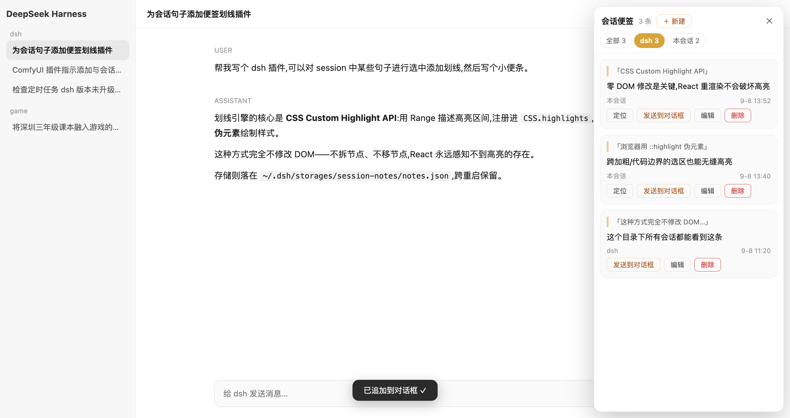

# Session Notes — DSH 会话划线便签插件

> Unofficial project, independently developed and maintained by community members.
> 非官方项目,由社区成员独立开发和维护。

**English** · [中文说明](#中文说明)

Highlight any sentence in your DeepSeek Harness (DSH) conversation, attach a sticky note to it, and keep all notes in a right-side panel — filterable by current workspace (directory) or current session. Notes persist across restarts and can be sent straight back into the composer.

在 DeepSeek Harness (DSH) 的会话消息中**选中任意句子划线**并记一张小便签;右侧面板聚合展示全部便签,支持按**当前目录 / 本会话**过滤;便签跨重启持久化,还可一键**发送到对话框**继续追问。



## Features

- ✍️ **Highlight & annotate** — select any text in a message (across bold/code/paragraph boundaries), click the floating **📝 记便签** button, write your note. The selection gets a persistent yellow highlight (CSS Custom Highlight API — zero DOM mutation, React-safe).
- 🗂 **Three scopes** — every note belongs to *this session*, *this workspace (directory)*, or *global (whole DSH)*. Create, edit and delete in the panel; scoped notes are visible from any session of that scope.
- 🔍 **Filterable panel** — toggle between All / current directory / current session, with live counts.
- 📤 **Send to composer** — append a note (content + quoted source) to the current input draft, ready to send.
- 👀 **View-first popup** — clicking a highlight opens the note read-only; editing is an explicit action.
- 🔄 **Self-healing highlights** — MutationObserver + 5s reconciliation re-apply highlights after re-renders, virtualization, or pagination.
- 💾 **Durable storage** — plain JSON at `~/.dsh/storages/session-notes/notes.json`; fs-service write with shell fallback, serialized queue.

## Install

Two forms are supported: **A. resident profile plugin**(常驻,重启后仍在,推荐)and **B. dynamic cordis package**(动态,免装即用,重启即失)。

### A. Resident — web profile plugin

1. Clone this repo anywhere on disk.
2. Link it into your web profile and install:

   ```bash
   cd ~/.dsh/profiles/web
   # package.json → "dependencies": { "dsh-session-notes": "link:<abs path to this repo>" }
   pnpm install
   ```

3. Append to `~/.dsh/profiles/web/cordis.patch.yml`:

   ```yaml
   - insert:
       - id: session-notes
         name: 'dsh-session-notes'
   ```

4. Restart `dsh web`. The host half serves `/session-notes/api/*`; the client half is picked up via the package's `dsh.client` declaration and bundled for every page load (UI survives refresh).

### B. Dynamic — cordis_define

Runs in the current `dsh web` process — no build step, no npm.

1. Clone or download this repo.
2. Open a DSH session (创造模式 / cordis preset — the one with `cordis_define` / `cordis_run` tools) and ask the agent:

   > 帮我安装这个插件:仓库 https://github.com/iptton-ai/dsh-plugin-session-notes。
   > 用 cordis_define 定义(读取 src/host.js 作为 code.host、src/client.js 作为 code.client,plugin id 前缀 snote),
   > 然后 cordis_run 激活并批准。

   Or, if you prefer doing it by hand: paste the two function bodies from `src/host.js` and `src/client.js` into `cordis_define`'s `code.host` / `code.client`, then `cordis_run` the returned package and approve it in the UI.

3. Refresh the page, open a session, and select some message text.

> Dynamic plugins live for the lifetime of the `dsh web` process. After a DSH restart, re-run step 2 (your notes on disk are kept).

## How it works

| Piece | Where | What |
| --- | --- | --- |
| Zero-DOM highlight engine | `src/client.js` | Matches each note's quote against the message flow with whitespace-folding + **gap-aware text assembly** (block/`<br>` boundaries insert `\n`, inline-adjacent nodes join seamlessly — mirrors `Selection.toString()`), then registers `Range`s into `CSS.highlights` (`::highlight(snote-hl)`). Falls back to `<mark>` wrapping on engines without the Highlight API. |
| Message-flow anchor | `src/client.js` | A hidden entry in the `conversation.composer.dock` slot walks up to the scroll container — no product class names, no DOM replacement. |
| Side panel / popups / selection button | `src/client.js` | Additive slot entries only: `shell.overlay`, `conversation.session.header.utilities`. |
| Persistence | `src/host.js` | Package-private RPC (`notes/list|add|update|delete|diag`) over `harness.handle`; stores JSON under `~/.dsh/storages/session-notes/`; per-call `danger-full-access` sandbox policy for its own storage file (the default `workspace-write` fence excludes `~/.dsh`). |

## Sandbox note

The host half explicitly passes `sandboxPolicy: { mode: 'danger-full-access' }` **only for its own storage file** (`~/.dsh/storages/session-notes/notes.json`), because the deployment-default `workspace-write` fence does not include the DSH home directory. The plugin never touches other paths.

---

## 中文说明

**Session Notes(会话划线便签)** 是一个 [DeepSeek Harness (DSH)](https://github.com/deepseek-ai/deepseek-harness) 的动态 Cordis 插件:像在书上做批注一样,在 AI 会话里边聊边划线、记便签。

### 功能特性

- ✍️ **划线记便签** —— 在任意消息中选中一段文字(跨加粗/行内代码/段落边界的选区都支持),点选区上方的「📝 记便签」按钮写下想法,选中文本即获得持久的黄色划线。基于 CSS Custom Highlight API,**零 DOM 修改**,React 重渲染不会破坏高亮。
- 🗂 **三种归属** —— 每条便签可归属*本会话*、*当前目录(workspace)*或*全局(整个 DSH)*;在面板里可新建/编辑/删除,目录级与全局便签在该范围内所有会话可见。
- 🔍 **可过滤面板** —— 右侧面板支持 全部 / 当前目录 / 本会话 三档过滤,实时计数;点击划线默认打开**只读查看**弹窗,点「编辑」才进入编辑态。
- 📤 **发送到对话框** —— 把便签(内容 + 引用原文)一键追加到当前输入框草稿,直接继续追问。
- 🔄 **高亮自愈** —— MutationObserver + 5 秒对账,消息重渲染、翻页加载、虚拟化后划线自动恢复。
- 💾 **持久存储** —— 纯 JSON 落盘于 `~/.dsh/storages/session-notes/notes.json`,跨重启保留;fs 服务写入失败时自动降级 shell 通道,写队列失败隔离。

### 安装方法

这是一个 **DSH 动态 Cordis 插件**,直接运行在当前 `dsh web` 进程里 —— 无需构建、无需 npm。

1. 克隆或下载本仓库。
2. 打开一个带 `cordis_define` / `cordis_run` 工具的 DSH 会话(创造模式 / cordis 预设),对 agent 说:

   > 帮我安装这个插件:仓库 https://github.com/iptton-ai/dsh-plugin-session-notes。
   > 用 cordis_define 定义(读取 src/host.js 作为 code.host、src/client.js 作为 code.client,plugin id 前缀 snote),
   > 然后 cordis_run 激活并批准。

   也可以手动:把 `src/host.js`、`src/client.js` 两个函数体分别粘贴进 `cordis_define` 的 `code.host` / `code.client`,再 `cordis_run` 激活返回的 package 并在界面上批准。
3. 刷新页面,打开会话,选中一段消息文字即可开始。

> 动态插件的生命周期与 `dsh web` 进程一致。DSH 重启后重新执行第 2 步即可(磁盘上的便签数据不会丢)。

### 工作原理

| 模块 | 位置 | 说明 |
| --- | --- | --- |
| 零 DOM 高亮引擎 | `src/client.js` | 用空白折叠 + **间隙感知拼接**(块级/`<br>` 边界补 `\n`、inline 紧邻节点无缝相连,与 `Selection.toString()` 语义一致)把每条便签的引用文本匹配回消息流,然后构造 `Range` 注册进 `CSS.highlights`(`::highlight(snote-hl)` 伪元素绘制)。不支持该 API 的浏览器自动回退 `<mark>` 包裹方案。 |
| 消息流锚点 | `src/client.js` | 在 `conversation.composer.dock` 插槽注册一个隐藏锚点组件,向上定位消息滚动容器 —— 不依赖产品 class 名,不替换任何产品 UI。 |
| 面板 / 弹窗 / 选区按钮 | `src/client.js` | 全部为增量插槽项:`shell.overlay`、`conversation.session.header.utilities`。 |
| 持久化 | `src/host.js` | 通过 `harness.handle` 提供包私有 RPC(`notes/list|add|update|delete|diag`);JSON 存储于 `~/.dsh/storages/session-notes/`;对**自己的存储文件**按调用声明 `danger-full-access` 沙箱策略(部署默认的 `workspace-write` 围栏不覆盖 `~/.dsh`)。 |

### 沙箱说明

Host 半仅对**自己的存储文件**(`~/.dsh/storages/session-notes/notes.json`)显式传 `sandboxPolicy: { mode: 'danger-full-access' }`,原因是部署默认的 `workspace-write` 文件围栏不包含 DSH 主目录。插件不触碰其他任何路径。

## License

MIT
